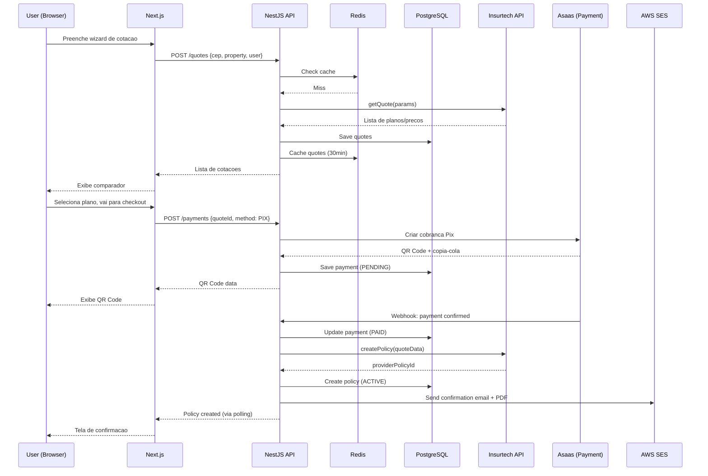

# 10. Core Workflows

### Quotation to Policy Workflow

```mermaid
sequenceDiagram
    participant U as User (Browser)
    participant W as Next.js
    participant A as NestJS API
    participant R as Redis
    participant DB as PostgreSQL
    participant I as Insurtech API
    participant P as Asaas (Payment)
    participant E as AWS SES

    U->>W: Preenche wizard de cotacao
    W->>A: POST /quotes {cep, property, user}
    A->>R: Check cache
    R-->>A: Miss
    A->>I: getQuote(params)
    I-->>A: Lista de planos/precos
    A->>DB: Save quotes
    A->>R: Cache quotes (30min)
    A-->>W: Lista de cotacoes
    W-->>U: Exibe comparador

    U->>W: Seleciona plano, vai para checkout
    W->>A: POST /payments {quoteId, method: PIX}
    A->>P: Criar cobranca Pix
    P-->>A: QR Code + copia-cola
    A->>DB: Save payment (PENDING)
    A-->>W: QR Code data
    W-->>U: Exibe QR Code

    P->>A: Webhook: payment confirmed
    A->>DB: Update payment (PAID)
    A->>I: createPolicy(quoteData)
    I-->>A: providerPolicyId
    A->>DB: Create policy (ACTIVE)
    A->>E: Send confirmation email + PDF
    A-->>W: Policy created (via polling)
    W-->>U: Tela de confirmacao
```

---

